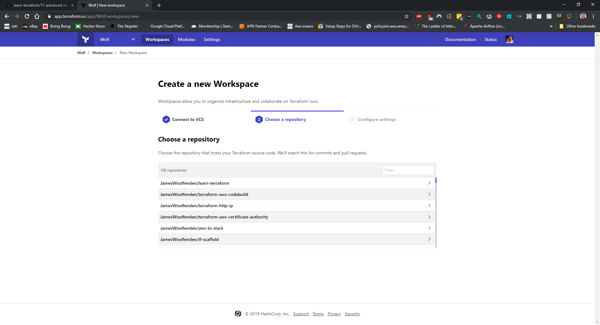
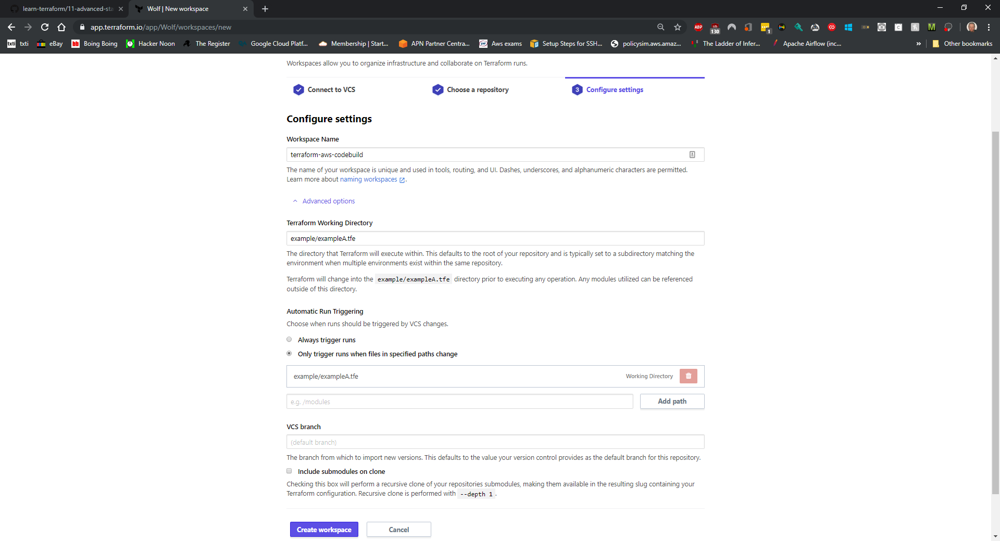
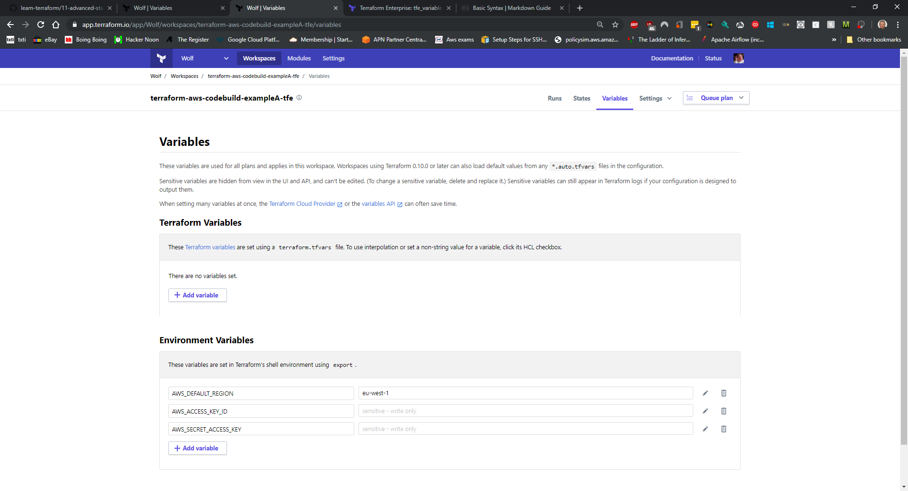

# State

## Moving to Terraform Remote State

Up to now all the examples have created a local state file, **terraform.tfstate**. If you are a lone developer operator then this could suffice, but if you lose that file or need to co-operate with other developers on changes a different approach is required.

## Local State

Have a look at the Terraform code you applied in the previous chapters, along with the files you wrote, you will see a file called **terraform.tfstate**.

Open it your editor, being careful not to change a thing.
TODO:typical content picture>

Re-apply the Terraform(This just to check that all is working currently)

```shell
$ Terraform apply
...
```

TODO:some output

After the apply is finished, rename the file **terraform.tfstate** to **terraform.tfstate.old**.

Now try to re-apply the same Terraform.

TODO:show some error

That failed. Lots of issues about resource existing?

That's easily fixed by reverting your re-naming.

So losing your terraform.tfstate file isn't great. That file is also best not left on your machine or on any server, plus it might have information you don't want shared.
If you ever want to automate or cooperate on infrastructure you must have a better solution.

The easiest way to solve this, in the cloud, is the use of a "State bucket". A State bucket might make you think of AWS but the same principal applies to Azure and GCP.

### AWS State Bucket

TODO:making a state bucket

### remote-state.tf

This is

## locking and unlock state buckets

When you add a state bucket you should also enable locking.
Locking is prevent clashes, when 2 developers/processes try to modify the same resource at the same time.
Should someone else be running your terraform at the same time via a state bucket you might see:

```shell
Error: Error locking state: Error acquiring the state lock: The process cannot access the file because another process has locked a portion of the file.
Lock Info:
  ID:        0e9bffe0-b181-c7ce-7155-beddbc24d829
  Path:      terraform.tfstate
  Operation: OperationTypePlan
  Who:       james.woolfenden@23043-5510
  Version:   0.11.11
  Created:   2019-03-18 22:21:55.075742 +0000 UTC
  Info:
Then you should wait until this pln/apply is over.
```

This can also occur if a lock was not released, If a previous run crashed or was cancelled then the lock maybe not be released?

You can then force an unlock, if you have locked your self then the forst step is kill any orphaned Terraform processes.

```shell
$ terraform force-unlock 0e9bffe0-b181-c7ce-7155-beddbc24d829
...
```

Terraform acquires a state lock to protect the state from being written
by multiple users at the same time. Please resolve the issue above and try
again. For most commands, you can disable locking with the "-lock=false"
flag, but this is not recommended.

## Versioning on the AWS bucket

TODO: versioning on an s3 bucket

## GCP and Azure

You can do a similar things with the other providers

### [Terraform Cloud](https://app.terraform.io) state

Sign up for a [Terraform Cloud account](https://app.terraform.io) and Create an organisation, and set up a workspace.



You can have multiple workspaces per repository:


Each workspace requires Authentication.


In your code Add or update your **terraform.tf** file to include:

```tf
terraform {
  backend "remote" {
    hostname     = "app.terraform.io"
    organization = "wolf"

    workspaces {
      name = "terraform-aws-codebuild-exampleA-tfe"
    }
  }
}

```

## Recovering and importing State

If you need to recreate or import existing infrastructure there a three main ways:-

## Terraform import

Most resources support the import keyword, this is the oldest method and is the slowest:

```cli
terraform import aws_s3_bucket.whosebucketisitanyway whosebucketisitanyway
```

By itself will fail with:

```cli
Error: resource address "aws_s3_bucket.whosebucketisitanyway" does not exist in the configuration.

Before importing this resource, please create its configuration in the root module. For example:

resource "aws_s3_bucket" "whosebucketisitanyway" {
  # (resource arguments)
}
```

So you will need to make the file **aws_s3_bucket.whosebucketisitanyway.tf** to succesfully associate it.

```cli
resource "aws_s3_bucket" "whosebucketisitanyway" {
}
```

But you will notice that your still need to update your resource to match your actual state.

```cli
$ terraform plan
Refreshing Terraform state in-memory prior to plan...
The refreshed state will be used to calculate this plan, but will not be
persisted to local or remote state storage.

aws_s3_bucket.whosebucketisitanyway: Refreshing state... [id=whosebucketisitanyway]

------------------------------------------------------------------------

An execution plan has been generated and is shown below.
Resource actions are indicated with the following symbols:
  ~ update in-place

Terraform will perform the following actions:

  # aws_s3_bucket.whosebucketisitanyway will be updated in-place
  ~ resource "aws_s3_bucket" "whosebucketisitanyway" {
      + acl                         = "private"
        arn                         = "arn:aws:s3:::whosebucketisitanyway"
        bucket                      = "whosebucketisitanyway"
        bucket_domain_name          = "whosebucketisitanyway.s3.amazonaws.com"
        bucket_regional_domain_name = "whosebucketisitanyway.s3.eu-west-1.amazonaws.com"
      + force_destroy               = false
        hosted_zone_id              = "Z1BKCTXD74EZPE"
        id                          = "whosebucketisitanyway"
        region                      = "eu-west-1"
        request_payer               = "BucketOwner"
        tags                        = {}

        versioning {
            enabled    = false
            mfa_delete = false
        }
    }

Plan: 0 to add, 1 to change, 0 to destroy.
```

## [Terraforming](https://github.com/dtan4/terraforming)

You'll need to install this. Terraforming can help with existing AWS infrastructure to generate the template.

```shell
$ aws s3 mb s3://whosebucketisitanyway
make_bucket: whosebucketisitanyway
$ aws s3 ls
2019-10-12 12:01:30 whosebucketisitanyway
$ terraforming s3
resource "aws_s3_bucket" "whosebucketisitanyway" {
    bucket = "whosebucketisitanyway"
    acl    = "private"
}
```

or the missing state:

```cli
$  terraforming s3 --tfstate
{
  "version": 1,
  "serial": 1,
  "modules": [
    {
      "path": [
        "root"
      ],
      "outputs": {
      },
      "resources": {
        "aws_s3_bucket.whosebucketisitanyway": {
          "type": "aws_s3_bucket",
          "primary": {
            "id": "whosebucketisitanyway",
            "attributes": {
              "acl": "private",
              "bucket": "whosebucketisitanyway",
              "force_destroy": "false",
              "id": "whosebucketisitanyway",
              "policy": ""
            }
          }
        }
      }
    }
  ]
}
```

## [Terraformer](https://github.com/GoogleCloudPlatform/terraformer)

This is a more sophisticated tool and has support for many more providers. You will need to have set-up the providers already.

```cli
terraformer import aws --resources=s3 --regions=eu-west-1
2019/10/12 14:01:16 aws importing region eu-west-1
2019/10/12 14:01:16 aws importing... s3
2019/10/12 14:01:17 [TRACE] GRPCProvider: GetSchema
2019/10/12 14:01:17 [TRACE] GRPCProvider: Configure
2019/10/12 14:01:19 [TRACE] GRPCProvider: GetSchema
2019/10/12 14:01:19 [TRACE] GRPCProvider: GetSchema
2019/10/12 14:01:20 [TRACE] GRPCProvider: Configure
2019/10/12 14:01:21 Refreshing state... aws_s3_bucket.whosebucketisitanyway
2019/10/12 14:01:21 [TRACE] GRPCProvider: GetSchema
2019/10/12 14:01:21 [TRACE] GRPCProvider: ReadResource
2019/10/12 14:01:24 aws Connecting....
2019/10/12 14:01:24 aws save s3
2019/10/12 14:01:24 [DEBUG] New state was assigned lineage "4b60793a-54f0-acf6-7e9a-89242e7feb84"
2019/10/12 14:01:24 aws save tfstate for s3
```

This will make everything you need:

```cli
$ ls generated/aws/s3/eu-west-1 -l
total 4
-rwxrwxrwx 1 jim jim  106 Oct 12 14:32 outputs.tf
-rwxrwxrwx 1 jim jim   65 Oct 12 14:32 provider.tf
-rwxrwxrwx 1 jim jim  394 Oct 12 14:32 s3_bucket.tf
-rwxrwxrwx 1 jim jim 2460 Oct 12 14:32 terraform.tfstate
```
