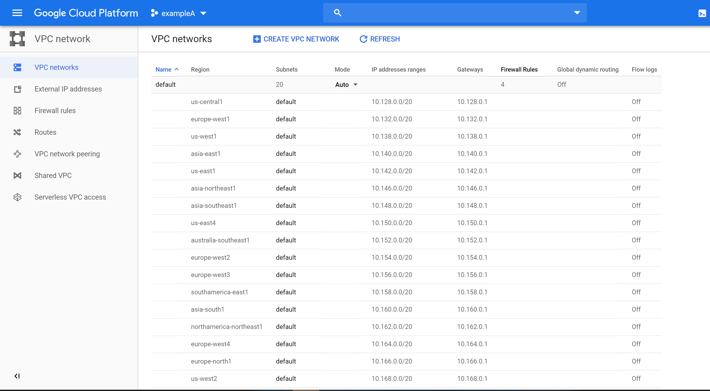

# Creating a Virtual Private Cloud

## Creating an GCP VPC

Creating A VPC with Terraform is fairly straight forward.
A minimal functional example configuration is just:

```terraform
resource "google_compute_network" "vpc_network" {
  name = "lovelyhorse"
}
```

Clone the terraform scaffold into **gcp_vpc**.

```cli
$ scaffold gcp_vpc --provider GCP
...
```

Add this file **google_compute_network.vpc_network.tf** to the a scaffold in gcp_vpc.
This is example only requires a name.

Open your shell at **./gcp_vpc** and check the configuration with:

```cli
terraform init
terraform apply
```


If your plan looks like above then you can proceed by approving.

Now you have a VPC, and not much else.

Open up the GCP console [GCP VPC](https://console.cloud.google.com/networking/networks/list?)



Scroll down and you'll find your new VPC.

Select your new VPC and edit.

## Clean up

We can clean up by destroying created VPC:

```cli
terraform destroy
```


Now everything that's been created has been removed.

### Complex example

TODO

### Shared VPC

toDo
