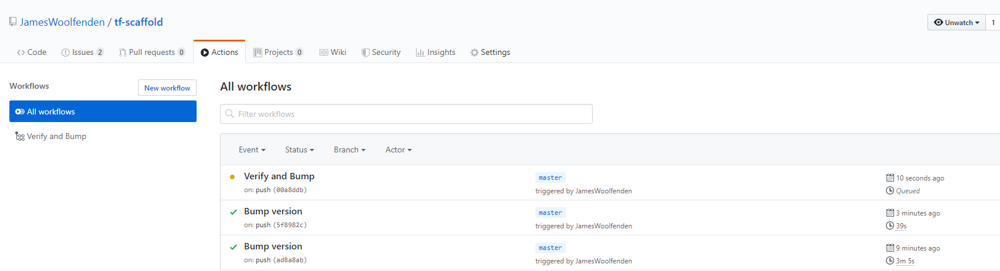
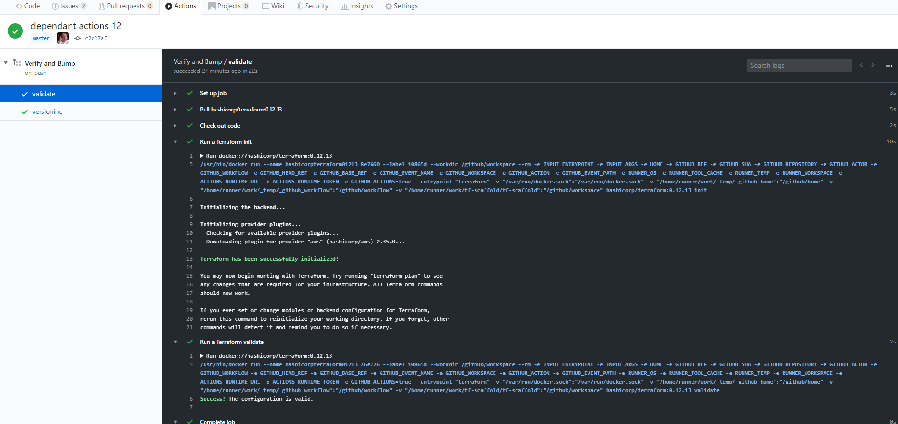

# Github actions

Github Actions now supports many pre-built actions and workflows. To build a module, the existing simple workflow can be added to your Github repo.



A minimal module build process is:

```bash
init
validate
bump and version
```

More details on the available syntax for actions is here <https://help.github.com/en/actions/automating-your-workflow-with-github-actions/workflow-syntax-for-github-actions>.

This example is based on this [example](https://github.com/JamesWoolfenden/terraform-aws-githubactions)

Add a file called **main.yml** to the folder _.github/workflows/_

```yaml
name: Verify and Bump
on:
  push:
    branches:
      - master
jobs:
  examples:
    name: "Terraform (examples)"
    runs-on: ubuntu-latest
    steps:
      - name: "Checkout"
        uses: actions/checkout@master
      - name: Run a Terraform init
        uses: docker://hashicorp/terraform:0.12.13
        with:
          entrypoint: terraform
          args: init example/examplea
      - name: "Terraform Validate"
        uses: docker://hashicorp/terraform:0.12.13
        with:
          entrypoint: terraform
          args: validate example/examplea

  build:
    name: versioning
    runs-on: ubuntu-latest
    steps:
      - uses: actions/checkout@master
      - name: Bump version and push tag
        uses: anothrNick/github-tag-action@master
        env:
          GITHUB_TOKEN: ${{ secrets.GITHUB_TOKEN }}
          DEFAULT_BUMP: patch
          WITH_V: "true"
    needs: examples
```

Then when you commit a change to master this action will init and validate on the folder **example/examplea** and then if successful tags the version number.



!!!Note
    This example extends:

    [https://github.com/marketplace/actions/github-tag-bump](https://github.com/marketplace/actions/github-tag-bump)

    [https://www.hashicorp.com/blog/continuous-integration-for-terraform-modules-with-github-actions/](https://www.hashicorp.com/blog/continuous-integration-for-terraform-modules-with-github-actions/)

    and [https://github.com/hashicorp/terraform-github-actions](https://github.com/hashicorp/terraform-github-actions)
